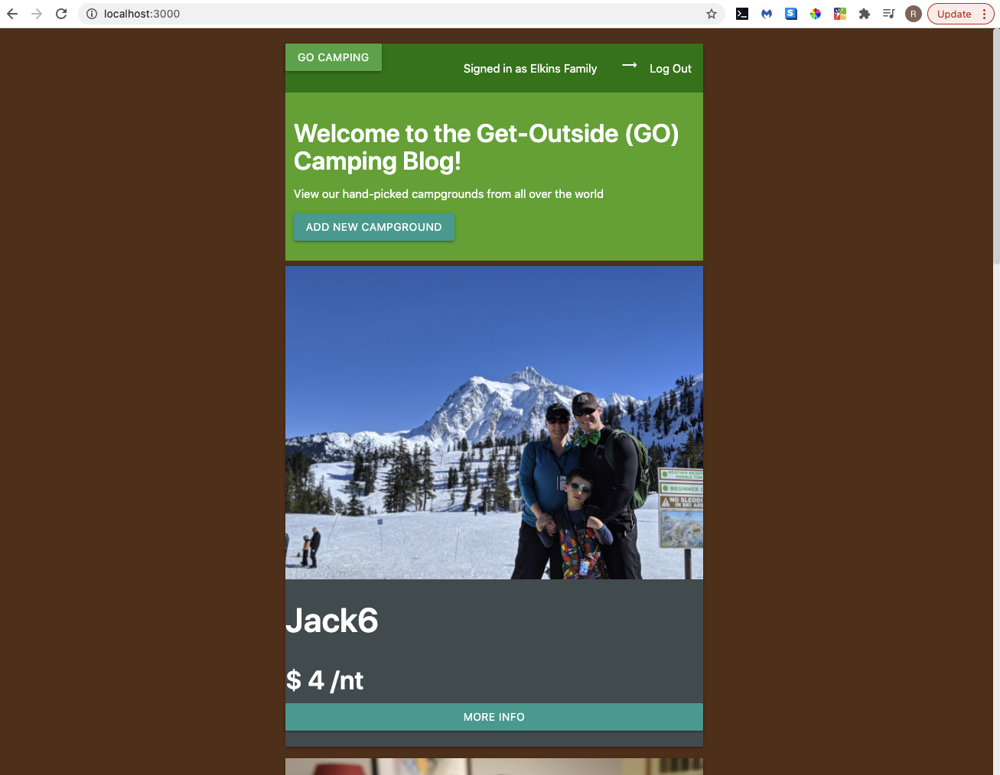
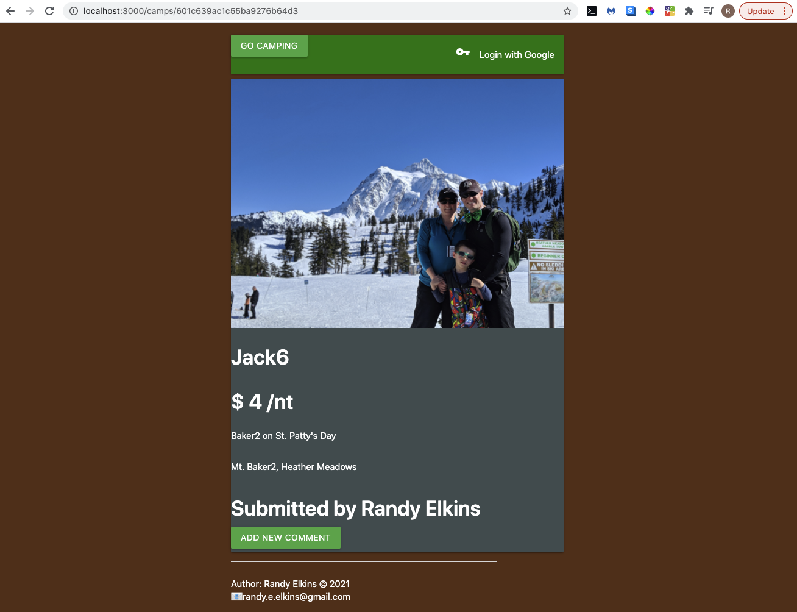
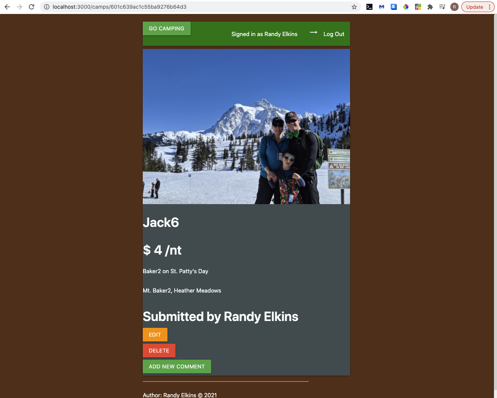

# Get-Outside (GO) Camping Blog
---
## Background
My family and I used to go camping fairly often, and this blog would be a great way to share the places we've been with others, as well as discover new places we haven't yet been from other people.

## The GO Camping Blog App

### Screenshot(s)
#### Homepage

#### Details Page for a Non-Logged In User

#### Details Page for a Logged In User

### Technologies Used
- HTML (via EJS)
- CSS (via 'home-grown' CSS, as well as Bootstrap)
- JavaScript

### Getting Started
Please click <!!!!!!>[HERE](https://www.google.com/)<!!!!!!> to open the app.

### Next Steps
Below are list of features I'd like to add in the future:
- Google Maps showing the location of the campgrounds in the DB
- Allow people to comment to other people's comments
- Have the campgrounds listed in a sortable and filterable table
- Have users be able to rate the campgrounds, and have an overall average display
- Have users be able to share a campground with friends/family not yet members of the app